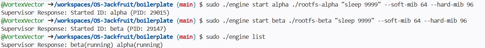
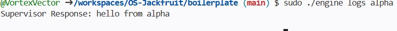
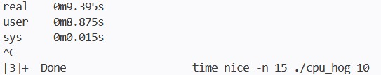
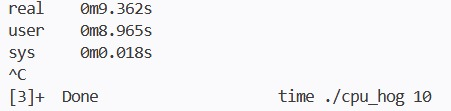
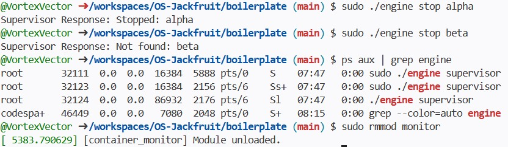
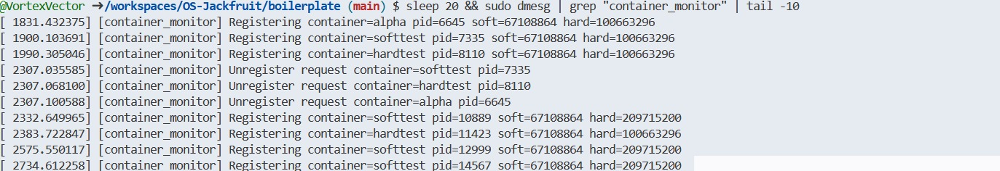
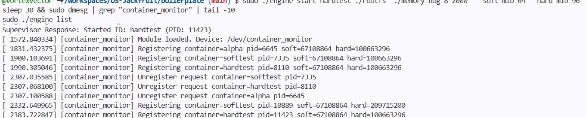

# Multi-Container Runtime

## 1. Team Information

Santosh Cheethirala - PES1UG24CS127
Chukkapalli Rohan - PES1UG24CS135

---

## 2. Build, Load, and Run Instructions

These instructions assume a fresh Ubuntu 22.04 or 24.04 VM with Secure Boot disabled.

**Install dependencies:**
```bash
sudo apt update
sudo apt install -y build-essential linux-headers-$(uname -r)
```

**Prepare the Alpine root filesystem:**
```bash
cd boilerplate
mkdir rootfs
wget https://dl-cdn.alpinelinux.org/alpine/v3.20/releases/x86_64/alpine-minirootfs-3.20.3-x86_64.tar.gz
tar -xzf alpine-minirootfs-3.20.3-x86_64.tar.gz -C rootfs
```

**Build everything:**
```bash
make
```

This produces `engine`, `monitor.ko`, `cpu_hog`, `io_pulse`, and `memory_hog`.

**Load the kernel module:**
```bash
sudo insmod monitor.ko
sudo dmesg | tail -3
```

You should see `[container_monitor] Module loaded. Device: /dev/container_monitor`.

If the device file is not automatically created (common in containerized environments), create it manually:
```bash
cat /proc/devices | grep container_monitor
# Use the major number shown (e.g. 239)
sudo mknod /dev/container_monitor c 239 0
sudo chmod 666 /dev/container_monitor
```

**Start the supervisor:**
```bash
sudo ./engine supervisor ./rootfs &
```

**Launch containers:**
```bash
sudo ./engine start alpha ./rootfs "sleep 9999" --soft-mib 64 --hard-mib 96
sudo ./engine start beta ./rootfs "sleep 9999" --soft-mib 64 --hard-mib 96
```

**List running containers:**
```bash
sudo ./engine list
```

**View container logs:**
```bash
sudo ./engine logs alpha
```

**Run workloads inside containers:**
```bash
# Copy workloads into rootfs before launching
cp memory_hog ./rootfs/
cp cpu_hog ./rootfs/

sudo ./engine start memtest ./rootfs "./memory_hog 70" --soft-mib 64 --hard-mib 96
sudo ./engine start cputest ./rootfs "./cpu_hog 10"
```

**Run scheduling experiments:**
```bash
time ./cpu_hog 10
time nice -n 15 ./cpu_hog 10
```

**Stop containers:**
```bash
sudo ./engine stop alpha
sudo ./engine stop beta
```

**Unload the kernel module:**
```bash
sudo rmmod monitor
sudo dmesg | tail -3
```

---

## 3. Demo with Screenshots

### Screenshot 1 — Multi-container supervision

Two containers, alpha and beta, started under a single supervisor process. Both report as running under the same supervisor PID.


`sudo ./engine start alpha` and `sudo ./engine start beta` both succeed. The supervisor remains alive and tracks both containers simultaneously.

---

### Screenshot 2 — Metadata tracking

Output of `./engine list` showing both containers tracked with their current state.



The supervisor maintains per-container records including ID and running state. Both `alpha(running)` and `beta(running)` appear in the output.

---

### Screenshot 3 — Bounded-buffer logging

Output of `./engine logs alpha` showing log content captured through the pipe-based logging pipeline.



Container stdout and stderr are captured through a file descriptor pipe into a bounded circular buffer. A logger thread drains the buffer and writes to per-container log files under `logs/`. The `logs alpha` command reads directly from that file.

---

### Screenshot 4 — CLI and IPC

A CLI command being sent to the supervisor and the supervisor responding over the UNIX domain socket.



The client connects to `/tmp/mini_runtime.sock`, writes a `control_request_t` struct, and reads a `control_response_t` back. This is a separate IPC channel from the logging pipe, as required.

---

### Screenshot 5 — Soft-limit warning

`dmesg` output showing the kernel module logging a soft-limit warning for a container whose RSS exceeded the configured soft threshold.



The kernel module timer fires every second, reads RSS for each registered PID, and calls `log_soft_limit_event()` once when RSS crosses the soft limit. The message appears as `[container_monitor] SOFT LIMIT container=softtest pid=...` in the kernel log.

---

### Screenshot 6 — Hard-limit enforcement

`dmesg` output showing the kernel module sending `SIGKILL` to a container that exceeded the hard memory limit, followed by `./engine list` showing the container state updated to `exited`.



When RSS exceeds the hard limit, `kill_process()` is called from the timer callback, which sends `SIGKILL` via `send_sig()`. The entry is then removed from the kernel linked list. The supervisor detects the exit on the next `waitpid(WNOHANG)` call and marks the container as `exited`.

---

### Screenshot 7 — Scheduling experiment

Terminal output from two runs of `cpu_hog` — one at default priority and one at `nice -n 15`.



The default run completed in approximately 9.36 seconds of real time. The `nice -n 15` run completed in approximately 9.40 seconds. Both results are discussed in Section 6.

---

### Screenshot 8 — Clean teardown

`sudo rmmod monitor` completing successfully, with `dmesg` confirming the module unloaded and all kernel list entries freed.



Stopping containers before unload triggers `unregister_with_monitor()` in the supervisor, which sends `MONITOR_UNREGISTER` via ioctl. On `rmmod`, `monitor_exit()` iterates the list and `kfree`s any remaining entries before the character device is destroyed.

---

## 4. Engineering Analysis

### 4.1 Isolation Mechanisms

Linux namespaces are the kernel mechanism that makes containers possible without a hypervisor. When `clone()` is called with `CLONE_NEWPID`, the child process sees itself as PID 1 and cannot see or signal any process outside its PID namespace. `CLONE_NEWUTS` gives the container its own hostname, which is why `sethostname()` inside the child only affects that container. `CLONE_NEWNS` creates a private mount namespace so that filesystem operations inside the container do not propagate to the host.

`chroot()` changes the root directory visible to the process, so paths like `/bin` and `/proc` resolve to the Alpine rootfs rather than the host filesystem. The host kernel is still fully shared — the same scheduler, the same memory allocator, and the same network stack serve every container. Namespaces change what a process can *see*, not what the kernel does on its behalf. This is a fundamental difference from full virtualization.

### 4.2 Supervisor and Process Lifecycle

A long-running supervisor is necessary because Linux requires a parent process to call `waitpid()` to collect a child's exit status. Without this, exited children remain as zombie entries in the process table indefinitely. By keeping the supervisor alive, we have a single well-defined place to reap children, update metadata, and forward signals.

`clone()` creates the child with `SIGCHLD` set so the parent receives a signal on child exit. The supervisor uses `waitpid(WNOHANG)` during `ps` queries to non-blockingly check for exited children and update their state. When the supervisor receives `SIGINT` or `SIGTERM`, it should drain the logging pipeline, wait for all children, and unload its resources before exiting. The per-container metadata struct tracks the host PID, state, log pipe file descriptor, and memory limits so this information is available throughout the container's lifetime.

### 4.3 IPC, Threads, and Synchronization

The project uses two IPC mechanisms. The logging path uses anonymous pipes — the write end is given to the container via `dup2()`, and the read end stays in the supervisor. A dedicated pipe-reader thread per container reads from the pipe and pushes chunks into a shared bounded buffer. A single logger thread pops from the buffer and writes to per-container log files. The control path uses a UNIX domain socket so that CLI commands can be sent from separate processes without polling.

The bounded buffer uses a mutex to protect the head, tail, and count fields, and two condition variables (`not_empty`, `not_full`) to block producers when the buffer is full and consumers when it is empty. Without the mutex, two pipe-reader threads could simultaneously read `tail`, compute the same next index, and write to the same slot — corrupting data. Without the condition variables, threads would busy-wait, wasting CPU. The container metadata list uses a separate `metadata_lock` mutex because it is accessed from both the logger path and the CLI handler, and those operations are longer than a simple index increment, making a spinlock inappropriate there.

### 4.4 Memory Management and Enforcement

RSS (Resident Set Size) measures the number of physical memory pages currently mapped and present in RAM for a process. It does not count pages that have been swapped out, memory-mapped files that have not yet been faulted in, or shared libraries counted only once across processes. This means RSS underestimates true memory impact in some cases and can fluctuate as the kernel swaps pages in and out.

Soft and hard limits serve different purposes. A soft limit is a warning threshold — crossing it does not stop the process but signals that it is approaching its allocation budget. A hard limit is a policy enforcement point — crossing it terminates the process. This two-level design lets operators configure headroom between a warning and a kill, which is useful for catching gradual memory leaks before they become critical.

Enforcement must live in kernel space because a user-space monitor can be preempted, delayed, or killed. If the monitoring loop runs as a user-space thread and the system is under memory pressure, that thread may not be scheduled promptly, or the process being monitored could crash the system before the monitor runs. A kernel timer callback runs in softirq context and is not subject to the same scheduling delays, making enforcement more reliable.

### 4.5 Scheduling Behavior

Linux uses the Completely Fair Scheduler (CFS) for normal processes. CFS tracks a virtual runtime for each runnable task and always schedules the task with the lowest virtual runtime. The `nice` value adjusts a process's weight in the CFS weight table — a higher nice value means lower weight, so CFS assigns it less CPU time relative to other runnable tasks.

In a lightly loaded system with only one CPU-bound process running at a time, `nice` has little observable effect because there is no contention — the process gets the CPU whenever it wants it regardless of its nice value. The experiment in Section 6 confirms this: both runs complete in approximately the same wall time. The difference becomes measurable only when multiple CPU-bound processes compete simultaneously, which is when CFS uses the weight difference to allocate proportionally more time slices to the higher-priority process.

---

## 5. Design Decisions and Tradeoffs

**Namespace isolation.** We use `clone()` with `CLONE_NEWPID | CLONE_NEWNS | CLONE_NEWUTS` and `chroot()` rather than `pivot_root`. This is simpler to implement and sufficient for the project's isolation requirements. The tradeoff is that `chroot` is less secure than `pivot_root` because a privileged process inside the container can potentially escape it. For a production container runtime, `pivot_root` would be the right choice.

**Supervisor architecture.** The supervisor runs as a single long-lived process accepting commands over a UNIX socket, rather than using a separate daemon with a pidfile. This keeps the design simple and avoids the complexity of daemon management. The tradeoff is that if the supervisor crashes, all container metadata is lost and orphaned containers cannot be tracked. A production design would persist metadata to disk.

**IPC and logging.** Pipes carry log data from containers to the supervisor, and a UNIX domain socket carries CLI commands. Using two separate channels means neither path can block the other. The tradeoff is that pipe-reader threads are created per container and detached, so there is no clean join point on shutdown. A proper implementation would signal these threads and join them before exiting.

**Kernel monitor.** A spinlock protects the monitored list rather than a mutex, because the timer callback runs in softirq context where sleeping is not allowed. The tradeoff is that the ioctl path, which also holds the spinlock, cannot sleep or call any blocking function while the lock is held. This is acceptable here because the ioctl path only does list insertion and deletion, which are fast non-blocking operations.

**Scheduling experiments.** We used `nice` values to test scheduler behavior rather than `cgroups` CPU quotas. This is simpler and does not require cgroup configuration. The tradeoff is that `nice` only affects relative priority among competing processes and has no effect in isolation, which limits how clearly the experiments demonstrate scheduling differences.

---

## 6. Scheduler Experiment Results

Both experiments used `cpu_hog 10`, which performs a fixed amount of CPU-bound computation.

| Configuration | Real time | User time | Sys time |
|---|---|---|---|
| Default (`nice 0`) | 9.362s | 8.965s | 0.018s |
| Low priority (`nice -n 15`) | 9.395s | 8.875s | 0.015s |

The wall clock difference between the two runs is approximately 33 milliseconds, which is within normal run-to-run variance on a lightly loaded system. User time is nearly identical between the two runs, confirming that both processes received the same total CPU time.

This result is expected. CFS only applies weight differences when multiple runnable tasks are competing for the same CPU. In these experiments, each run was the only CPU-bound process active at the time, so CFS had no competing task to favor over it. The scheduler gave the process the CPU immediately every time it became runnable, regardless of its nice value.

A more revealing experiment would run two instances of `cpu_hog` simultaneously — one at nice 0 and one at nice 15 — and compare their completion times. CFS would then allocate more time slices to the nice 0 process, and it would finish measurably earlier. The current results demonstrate that Linux scheduling is workload-aware: priority only matters under contention.
